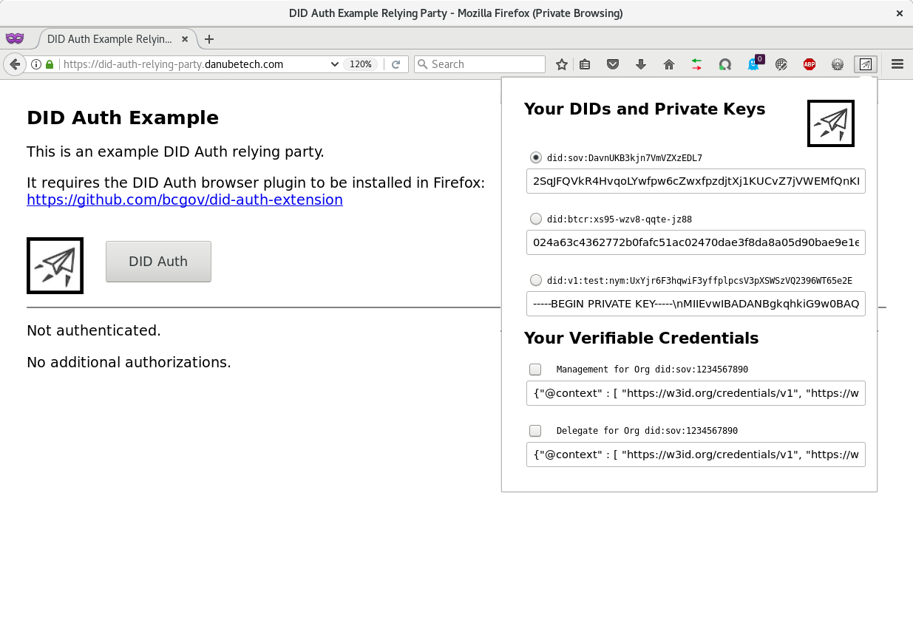
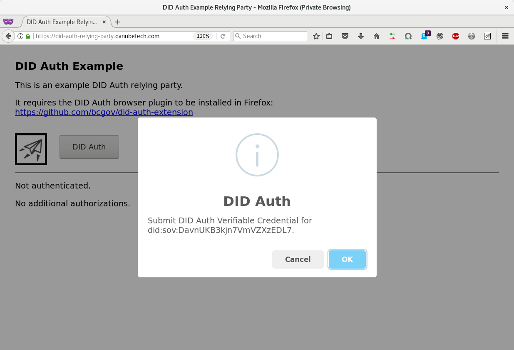
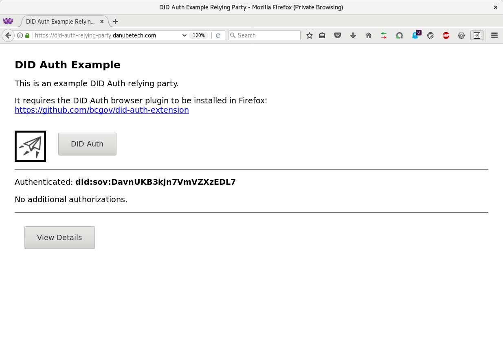

# Initial Reference Implementation of Decentralized Authentication (DID-Auth) and Authorization Mechanisms

<https://github.com/bcgov/TheOrgBook/issues/165>

Report for BCDevExchange Opportunity, 30th March 2018

Markus Sabadello – <https://github.com/peacekeeper/>

Danube Tech GmbH – <https://danubetech.com/>

Introduction
=======================================

As certain base technologies for self-sovereign identity are becoming more mature (e.g. [Decentralized Identifiers – DIDs](https://w3c-ccg.github.io/did-spec/), and [Verifiable Credentials](https://w3c.github.io/vc-data-model/)), there is now increasing interest in functionality and protocols such as authentication (“DID-Auth”) and authorization based on these core building blocks. The objective of this BCDevExchange opportunity was to design and implement – in collaboration with relevant communities – various DID-based authentication and authorization scenarios that can be integrated with [VON](https://github.com/bcgov/von) components such as [TheOrgBook](https://github.com/bcgov/TheOrgBook), [Permitify](https://github.com/bcgov/permitify), and the [VON agent](https://github.com/bcgov/von_agent).

Throughout February and March 2018, we interacted with the following communites:

 * The [Decentralized Identity Foundation’s](http://identity.foundation/) DID-Auth working group
 * The [W3C’s Credentials Community Working Group](https://w3c-ccg.github.io/)
 * The [Rebooting-the-Web-of-Trust\#6 workshop](https://github.com/WebOfTrustInfo/rebooting-the-web-of-trust-spring2018)

We also evaluated various existing work on this topic, including:

 * uPort’s [Selective Disclosure Flow](https://github.com/uport-project/specs/blob/develop/flows/selectivedisclosure.md)
 * The W3C’s [Credential Handler API](https://w3c-ccg.github.io/credential-handler-api/)
 * Evernym’s [early overview on DID-Auth](https://github.com/WebOfTrustInfo/rebooting-the-web-of-trust-spring2017/blob/master/event-documents/group-abstracts/did-auth.md)
 * A proposed [DID TLS specification](https://docs.google.com/document/d/1-aPY1eeHdR_TnF7_WpEs58RZ_jNdDeptVrNEu3groFc/)

It became clear that at this stage, there are still many different ideas about the scope, data formats, and protocols of DID-Auth and related functionality, so a [topic paper](https://github.com/WebOfTrustInfo/rebooting-the-web-of-trust-spring2018/blob/master/topics-and-advance-readings/DID%20Auth:%20Scope,%20Formats,%20and%20Protocols.md) was written to summarize use cases and current efforts in this space.

# Implementation

For the BCDevExchange opportunity, three components were implemented and contributed to the “bcgov” Github organization. The repositories include documentation, build instructions, and usage examples. After the initial contributions, several pull requests were later merged with smaller improvements and bug fixes.

## DID-Auth HTTP Proxy

Github repository: <https://github.com/bcgov/http-did-auth-proxy>

This is a DID-Auth HTTP proxy that uses [HTTP Signatures](https://www.ietf.org/id/draft-cavage-http-signatures-09.txt) based on [Decentralized Identifiers](https://w3c-ccg.github.io/did-spec/) for authenticated HTTP requests.

It can run in a “signing mode”, which adds a cryptographic signature to an HTTP request using a DID’s private key, and in a “verifying mode”, which verifies signatures on an HTTP request using a DID’s public key discovered via the [Universal Resolver](https://github.com/decentralized-identity/universal-resolver/).

This component currently requires access to the DID’s private key for “signing mode”. As a future improvement, an external signing service could be used, or existing libraries such as [indy-sdk](https://github.com/hyperledger/indy-sdk) could be used for the signing operation. An important objective however should remain that DID-Auth work with different DID methods and different key types.

## DID-Auth browser add-on

Github repository: <https://github.com/bcgov/did-auth-extension>

This is a WebExtensions-compatible DID-Auth browser add-on that supports DID-based authentication and authorization on relying party web pages.

After being invoked by JavaScript, it can submit signed, self-issued DID-Auth Verifiable Credentials that state “I am me” via HTTP POST to a website. It can also submit additional Verifiable Credentials for authorization purposes. This component follows the [Linked Data Signatures](https://w3c-dvcg.github.io/ld-signatures/) and [Linked Data Cryptographic Suites](https://w3c-ccg.github.io/ld-cryptosuite-registry/) specifications, as well as the data formats used by the [Credential Handler API](https://w3c-ccg.github.io/credential-handler-api/).

This functionality of authenticating and submitting Verifiable Credentials to a website can also be used for advanced [delegation scenarios](https://docs.google.com/document/d/1yZaBGWHv-ogzN6S2wZ95d1T_Ykeq0GTGGZv9trGc6Ws/).

## DID-Auth relying party

Github repository: <https://github.com/bcgov/did-auth-relying-party>

This is a DID-Auth relying party that can verify incoming DID-Auth messages expressed as [Verifiable Credentials](https://w3c.github.io/vc-data-model/) based on [Decentralized Identifiers](https://w3c-ccg.github.io/did-spec/).

It receives signed, self-issued DID-Auth Verifiable Credentials that state “I am me“ via HTTP POST. It can also receive additional Verifiable Credentials for authorization purposes. It verifies signatures on those Verifiable Credentials using an issuer’s DID’s public key discovered via the [Universal Resolver](https://github.com/decentralized-identity/universal-resolver/).

Upon successful verification of submitted Verifiable Credentials, a user’s DID can be considered authenticated, a web session can be started, and authorization decisions can be made based on additional Verifiable Credentials that have been submitted.

# Scenarios

The BCDevExchange opportunity defined four scenarios that make use of DID-based authentication and authorization for [VON](https://github.com/bcgov/von) components such as [TheOrgBook](https://github.com/bcgov/TheOrgBook), [Permitify](https://github.com/bcgov/permitify), and the [VON agent](https://github.com/bcgov/von_agent).

This section documents how the four scenarios can be met using the three components described in the previous section.

## System to System

Services that need to connect to TheOrgBook can use the **DID-Auth HTTP Proxy** in “signing mode” to sign HTTP requests. TheOrgBook can use the DID-Auth HTTP Proxy in “verifying mode” to verify HTTP requests and check a service’s authenticated DID against a whitelist.

Architecture for this scenario:

	                        sign HTTP request using       lookup DID key using Universal Resolver
	                       pre-configured DID and key            and verify HTTP signature
	                                   |                                     ^
	                                   v                                     |
	 _________________          ________________                      ________________          ________________
	|                 |  HTTP  |                |        HTTP        |                |  HTTP  |                |
	| HTTP Client     | -----> | Signing        | =================> | Verifying      | -----> | Protected      |
	|                 |        | DID Auth Proxy |                    | DID Auth Proxy |        | Target Service |
	|_________________|        |________________|                    |________________|        |________________|
	
	         (trust relationship)               (untrusted connection)               (trust relationship)
	         (e.g. local network)                                                    (e.g. local network) 

## Administrative

An individual can authenticate with their web browser to TheOrgBook by submitting a DID-Auth Verifiable Credential that states “I am me”, by using the **DID-Auth browser add-on**. TheOrgBook can in turn verify this Verifiable Credential by using the **DID-Auth relying party** component, which will return the individual’s authenticated identifier.

Architecture for this scenario:

	        sign VCredentials using                                lookup DID key using Universal Resolver
	       pre-configured DID and key                                      and verify VCredentials
	
	                  |                                                               ^
	                  v                                                               |
	           ________________                      ________________          ________________
	   ~o/    |                |     HTTP POST      |                |  HTTP  |                |
	   /|     | Web browser    | =================> | TheOrgBook     | <----> | DID Auth       |
	   / \    | with add-on    |                    | website        |        | relying party  |
	          |________________|                    |________________|        |________________|
	
	                           (untrusted connection)               (trust relationship)
	                                                                (e.g. local network) 

Example DID-Auth Verifiable Credential that states “I am me”:

	{
	        "@context" : [ "https://w3id.org/credentials/v1", "https://w3id.org/security/v1" ],
	        "type" : [ "Credential", "DidAuthCredential" ],
	        "issuer" : "did:btcr:xs95-wzv8-qqte-jz88",
	        "issued" : "2018-03-15",
	        "claim" : {
	                "id" : "did:btcr:xs95-wzv8-qqte-jz88",
	                "publicKey" : "did:btcr:xs95-wzv8-qqte-jz88#key-1"
	        },
	        "signature" : {
	                "type" : "EcdsaKoblitzSignature2016",
	                "creator" : "did:btcr:xs95-wzv8-qqte-jz88#key-1",
	                "created" : "2018-03-15T00:00:00Z",
	                "domain" : null,
	                "nonce" : "54c83860-a79b-4523-88f9-ad420c669c12",
	                "signatureValue" : "MEUCIQC8JxrztioLbR5dfQwLBPnKMfE6RObSU9jpAJUr+YBxSQIgCbTbiabx8DMeKKgW1BfT+c+U9fy7DnhYjfH1xGFU8GY="
	        }
	}

In this example, **did:btcr:xs95-wzv8-qqte-jz88** is the individual’s authenticated identifier.

## Claim Your Claims

This is similar to the previous scenario, but in addition, a Verifiable Credential is submitted that states that an individual has been given a certain role (e.g. “management”) for a certain organization in TheOrgBook, thus giving the individual the ability to access certain functionality.

Example DID-Auth Verifiable Credential that proves the individual’s “management” role for an organization:

	{
	        "@context" : [ "https://w3id.org/credentials/v1", "https://w3id.org/security/v1" ],
	        "type" : [ "Credential" ],
	        "issuer" : "did:sov:MDBKSD4Cm5EhhXWzTynube",
	        "issued" : "2018-03-15",
	        "claim" : {
	                "id" : "did:sov:1234567890",
	                "management" : "did:sov:DavnUKB3kjn7VmVZXzEDL7"
	        },
	        "signature" : {
	                "type" : "Ed25519Signature2018",
	                "creator" : "did:sov:MDBKSD4Cm5EhhXWzTynube#key-1",
	                "created" : "2018-03-15T00:00:00Z",
	                "domain" : null,
	                "nonce" : "d1458980-d63b-4c3c-aad9-f1d182f5b399",
	                "signatureValue" : "CGG+Isa9QtpqS9NuKTATBipY2cb50fFlCKHyLPV+Z136m304IqHjWnP9M0QM6i4ilYuUcS2ibOJtjWPHfmk7AQ=="
	        }
	}

In this example, **did:sov:MDBKSD4Cm5EhhXWzTynube** is an authority that has given the individual **did:sov:DavnUKB3kjn7VmVZXzEDL7** the “management” role for the organization **did:sov:1234567890**.

## Delegation

This is similar to the previous scenario, but in addition, a Verifiable Credential is submitted that states that the individual has delegated a certain role (e.g. “management”) for a certain organization in TheOrgBook, thus giving the delegate the ability to access certain functionality.

Example DID-Auth Verifiable Credential that proves the individual’s delegation of the “management” role for an organization:

	{
	        "@context" : [ "https://w3id.org/credentials/v1", "https://w3id.org/security/v1" ],
	        "type" : [ "Credential" ],
	        "issuer" : "did:sov:DavnUKB3kjn7VmVZXzEDL7",
	        "issued" : "2018-03-15",
	        "claim" : {
	                "id" : "did:sov:1234567890",
	                "management" : "did:v1:test:nym:UxYjr6F3hqwiF3yffplpcsV3pXSWSzVQ2396WT65e2E"
	        },
	        "signature" : {
	                "type" : "Ed25519Signature2018",
	                "creator" : "did:sov:DavnUKB3kjn7VmVZXzEDL7#key-1",
	                "created" : "2018-03-15T00:00:00Z",
	                "domain" : null,
	                "nonce" : "17eb96ae-ccef-4500-bb5b-01e92a93abe7",
	                "signatureValue" : "YuYSql92rC1PloE3TNSD/4LJ15I3zbbMtYB4D6BSWdnuvOJBX1WobbDC0/tAcuJ0xWkL47DpOibJXFsKIjlsDw=="
	        }
	}

In this example, **did:sov:DavnUKB3kjn7VmVZXzEDL7** is an individual that has given the delegate **did:v1:test:nym:UxYjr6F3hqwiF3yffplpcsV3pXSWSzVQ2396WT65e2E** the “management” role for the organization **did:sov:1234567890**.

# Screenshots

# Outlook

As an immediate next step, we will present the work that has been done at the upcoming [Internet Identity Workshop 26](http://www.internetidentityworkshop.com/) and discuss the current state as well as future roadmap of DID-Auth and related topics with the community.

By the end of April 2018, we plan to complete a [DID-Auth paper](https://github.com/WebOfTrustInfo/rebooting-the-web-of-trust-spring2018/blob/master/draft-documents/did_auth_draft.md) that was started at the Rebooting-the-Web-of-Trust\#6 workshop.

There are still several major open questions that the community will have to agree on. This includes the data formats to be used (JWT vs. Verifiable Credentials), the use of HTTP Signatures and DID-TLS for authenticated channels, the use of proofs other than cryptographic signatures (e.g. biometrics), and flows and transport mechanisms (browser based, mobile app based, service-to-service, etc.).

Another big open question is the relationship between DID-Auth (for authentication) and a protocol for exchange of Verifiable Credentials. One viewpoint is that they should be kept completely separate, i.e. a first step is authentication between parties, and exchange of Verifiable Credentials can happen in the subsequent step. Another possible viewpoint is that “proving control over an identifier” is not much different from “proving possession of a credential”, and that therefore both functions can be implemented by a single protocol. A [thread on this topic](https://lists.w3.org/Archives/Public/public-credentials/2018Mar/0074.html) has recently occurred on the W3C Credentials Community Group’s mailing list.

DID-Auth will also have to address “traditional identity challenges” that are well-understood in other protocols such as OpenID Connect. For example, support for pairwise-pseudonymous identifiers (also known as “directed identity”) is considered important for privacy, i.e. different DIDs should be used for authenticating to different parties. Another example of a well-understood challenge in traditional identity protocols is single logout, i.e. if a DID is revoked/terminated, DID-Auth should make sure that any open authenticated sessions involving that DID are terminated as well.

The long-term objective should be to develop a DID-Auth standard through a standards organization such as the W3C (where DIDs and Verifiable Credentials are already being specified). This may involve dividing a DID-Auth standard into several separate modules, e.g. to define a core data format for challenges and responses, and then to define various transports or bindings through which they can be transmitted. A DID-Auth standard must also define its place relative to other standardization efforts in this space, e.g. WebID or WebAuthn.